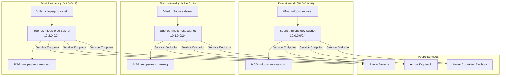

# Phase 1: Infrastructure Implementation

This document describes the implementation of the base infrastructure for the Azure MLOps Accelerator.

## Components Implemented

1. **Terraform Modules**
   - **Networking**: Virtual Network, Subnet, and Network Security Group
   - **Storage**: Azure Storage Account with containers for data, models, and scripts
   - **Compute**: CPU compute cluster with autoscaling
   - **AML Workspace**: Azure Machine Learning workspace with associated resources
   - **Model Registry**: Using Azure ML Registry via the azapi provider

2. **Environment Configurations**
   - **Shared**: Contains the model registry and shared resources
   - **Dev**: Development environment with minimal resources
   - **Test**: Test environment with similar configuration to Dev
   - **Prod**: Production environment with enhanced security and performance

   Each environment (dev, test, prod) is separated by resource groups, not subscriptions. They each have their own:
   - Resource group with naming pattern: `mlops-{env}-rg` (e.g., mlops-dev-rg)
   - Dedicated networking with different CIDR ranges:
     - Dev: 10.0.0.0/16
     - Test: 10.1.0.0/16
     - Prod: 10.2.0.0/16
   - Environment-specific storage accounts and ML workspaces

   The shared resources (model registry) are in a separate resource group called `mlops-shared-rg`.

3. **CI/CD Pipeline**
   - GitHub Actions workflow for Terraform deployment

## Architecture

The architecture follows a multi-environment setup with a shared model registry:

### High-Level Architecture

```mermaid
flowchart TB
    %% First row - Shared Resources at the top
    subgraph SR["Shared Resources"]
        MR[Model Registry]
        SS[Shared Storage]
    end

    %% Second row - environments side by side
    subgraph DEV["Dev Environment"]
        DevRG[Resource Group]
        DevNet[Virtual Network]
        DevStor[Storage Account]
        DevWS[AML Workspace]
        DevComp[Compute Cluster]
        DevKV[Key Vault]
        DevACR[Container Registry]
        DevAI[Application Insights]
    end

    subgraph TEST["Test Environment"]
        TestRG[Resource Group]
        TestNet[Virtual Network]
        TestStor[Storage Account]
        TestWS[AML Workspace]
        TestComp[Compute Cluster]
        TestKV[Key Vault]
        TestACR[Container Registry]
        TestAI[Application Insights]
    end

    subgraph PROD["Production Environment"]
        ProdRG[Resource Group]
        ProdNet[Virtual Network]
        ProdStor[Storage Account]
        ProdWS[AML Workspace]
        ProdComp[Compute Cluster]
        ProdKV[Key Vault]
        ProdACR[Container Registry]
        ProdAI[Application Insights]
    end

    %% Layout control - place DEV, TEST, PROD in a row
    SR --> DEV
    SR --> TEST
    SR --> PROD

    %% Model Registry Connections
    MR --> DevWS
    MR --> TestWS
    MR --> ProdWS

    %% Dev Environment Connections
    DevRG --> DevNet
    DevRG --> DevStor
    DevRG --> DevWS
    DevWS --> DevComp
    DevWS --> DevKV
    DevWS --> DevACR
    DevWS --> DevAI
    DevWS --> DevStor

    %% Test Environment Connections
    TestRG --> TestNet
    TestRG --> TestStor
    TestRG --> TestWS
    TestWS --> TestComp
    TestWS --> TestKV
    TestWS --> TestACR
    TestWS --> TestAI
    TestWS --> TestStor

    %% Production Environment Connections
    ProdRG --> ProdNet
    ProdRG --> ProdStor
    ProdRG --> ProdWS
    ProdWS --> ProdComp
    ProdWS --> ProdKV
    ProdWS --> ProdACR
    ProdWS --> ProdAI
    ProdWS --> ProdStor

    %% Network Configuration
    DevNet -- "10.0.0.0/16" --> DevStor
    TestNet -- "10.1.0.0/16" --> TestStor
    ProdNet -- "10.2.0.0/16" --> ProdStor
```



### Network Architecture



## Testing Phase 1

To test that the Phase 1 implementation is working correctly, follow these steps:

### Prerequisites

1. Azure subscription
2. Azure CLI installed and configured
3. Terraform CLI installed (version >= 1.0.0)
4. Git and GitHub account for CI/CD

### Manual Deployment Testing

1. **Deploy Shared Resources First**:
   ```bash
   cd terraform/environments/shared
   terraform init
   terraform plan
   terraform apply
   ```

2. **Deploy Dev Environment**:
   ```bash
   cd ../dev
   terraform init
   terraform plan
   terraform apply
   ```

3. **Verify Resources in Azure Portal**:
   - Check that all resource groups are created
   - Verify the Azure ML workspaces are properly configured
   - Ensure the compute cluster is created and can be started

### CI/CD Pipeline Setup and Testing

1. **Configure Azure Authentication**:

   a. **Register an App in Azure AD**:
   ```bash
   # Login to Azure
   az login

   # Create an Azure AD app registration
   az ad app create --display-name "MLOps-GitHub-Actions"

   # Get the Application (client) ID
   CLIENT_ID=$(az ad app list --display-name "MLOps-GitHub-Actions" --query "[0].appId" -o tsv)

   # Create a service principal for the app
   az ad sp create --id $CLIENT_ID

   # Get the Service Principal Object ID (needed for role assignment)
   SP_OBJECT_ID=$(az ad sp show --id $CLIENT_ID --query "id" -o tsv)

   # Get your subscription ID
   SUBSCRIPTION_ID=$(az account show --query id -o tsv)

   # Assign Contributor role to the service principal
   az role assignment create --assignee $SP_OBJECT_ID --role "Contributor" --scope "/subscriptions/$SUBSCRIPTION_ID"
   ```

   b. **Configure Federated Credentials**:
   ```bash
   # Configure federated credentials for GitHub Actions
   az ad app federated-credential create \
     --id $CLIENT_ID \
     --parameters "{\"name\":\"github-actions\",\"issuer\":\"https://token.actions.githubusercontent.com\",\"subject\":\"repo:your-github-username/azure-mlops:ref:refs/heads/main\",\"audiences\":[\"api://AzureADTokenExchange\"]}"

   # Get your tenant ID
   TENANT_ID=$(az account show --query tenantId -o tsv)

   # Display the values to add as GitHub secrets
   echo "AZURE_CLIENT_ID: $CLIENT_ID"
   echo "AZURE_TENANT_ID: $TENANT_ID"
   echo "AZURE_SUBSCRIPTION_ID: $SUBSCRIPTION_ID"
   ```

2. **Setup GitHub Secrets**:
   - Add the following secrets to your GitHub repository:
     - `AZURE_CLIENT_ID`: The Application (client) ID from the app registration
     - `AZURE_TENANT_ID`: Your Azure AD tenant ID
     - `AZURE_SUBSCRIPTION_ID`: Your Azure subscription ID

3. **Trigger the Pipeline**:
   - Push a change to the `terraform` directory
   - Or manually trigger the workflow using the workflow_dispatch event

4. **Verify Pipeline Execution**:
   - Check GitHub Actions logs
   - Verify Terraform plan output
   - Confirm successful resource creation after apply

### Validation Tests

1. **Networking Test**:
   - Verify VNet and subnet connectivity
   - Check NSG rules

2. **Storage Test**:
   - Verify containers are created
   - Test uploading a small file

3. **AML Workspace Test**:
   - Log in to AML workspace
   - Create a simple experiment

4. **Compute Test**:
   - Start the compute cluster
   - Run a simple job

5. **Model Registry Test**:
   - Register a simple model
   - Verify it's accessible from all environments

## Next Steps

After validating the infrastructure, proceed to Phase 2 where we'll develop ML pipeline templates to run on this infrastructure.
